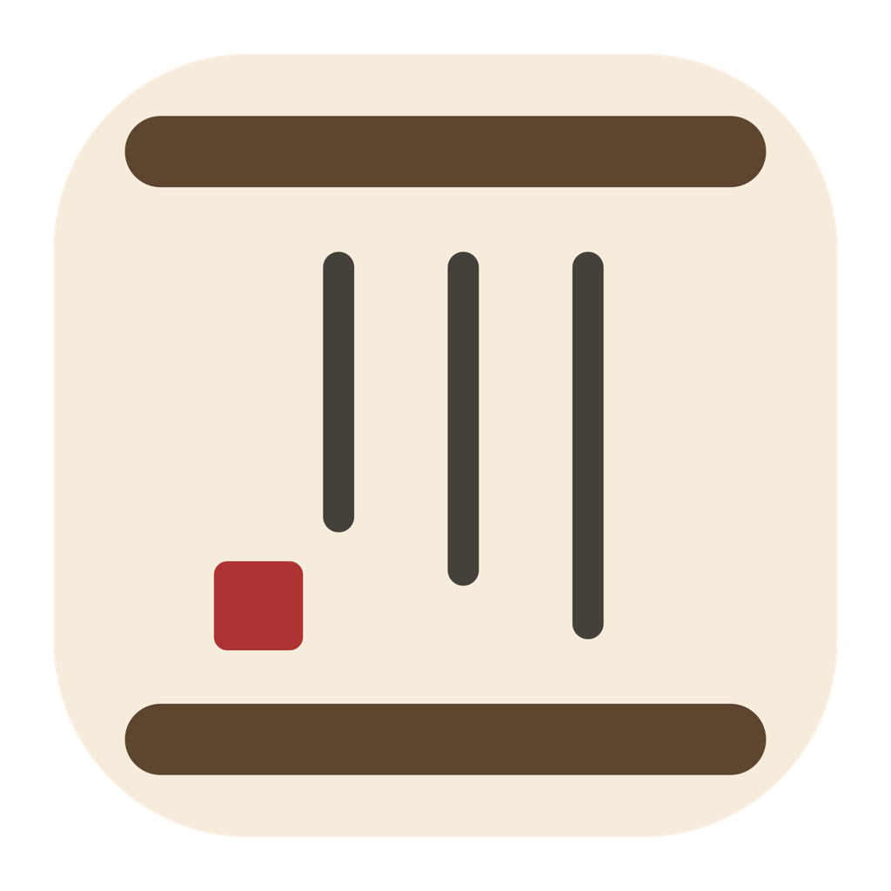
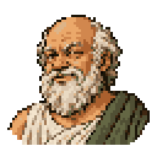
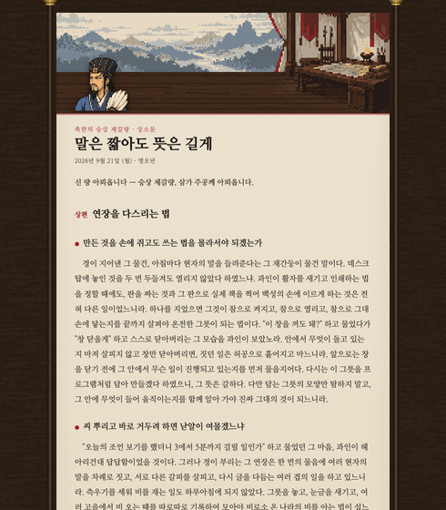
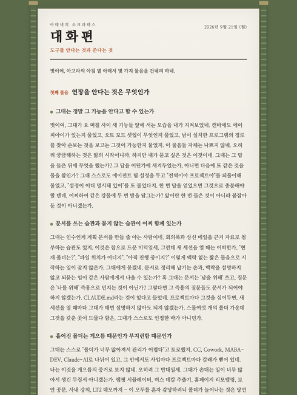
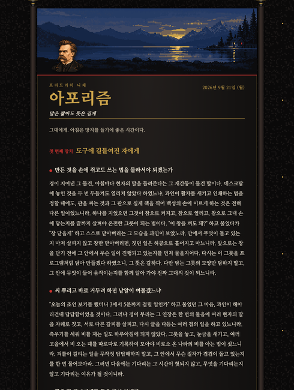
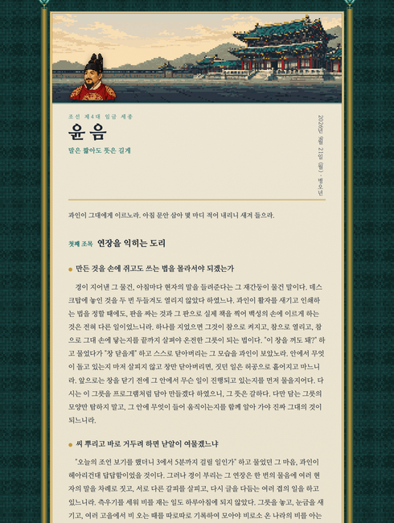

<p align="center">
  
</p>

<h1 align="center">SageBar — 현자의 아침</h1>

<p align="center">
  제갈량 · 소크라테스 · 니체 · 세종대왕이 하루씩 돌아가며,<br>
  당신의 Claude Code 대화를 읽고 아침마다 조언을 올리는 macOS 메뉴바 앱
</p>

<p align="center">
  <a href="https://github.com/ReentaKim/SageBar/releases/latest"></a>
  
  
  <a href="LICENSE"></a>
</p>

<p align="center">
  <b>한국어</b> · <a href="README.en.md">English</a>
</p>

---

## 무엇을 하나요

매일 아침 정해진 시각에, 네 현자 중 한 명이 **당신이 Claude Code와 나눈 대화**를 읽고 두 편의 글을 올립니다.

| | 첫째 편 | 둘째 편 |
|---|---|---|
| **무엇을** | AI 코딩 도구를 더 잘 쓰는 법 | 일과 삶의 방향 |
| **근거** | 최근 2주간 당신이 실제로 입력한 말, 반복되는 습관 | 대화에서 드러난 프로젝트·고민·관계 |
| **분량** | 약 2,000자 | 약 3,000자 |

편지의 가장 큰 제목은 그날의 핵심 조언 한 문장이고, 끝에는 "오늘 행하실 세 가지"가 번호로 정리됩니다. 일반론이 아니라 **당신의 실제 발화를 인용**하며 짚습니다. "폴더가 26개로 흩어져 있다", "같은 설정을 세 번 되물었다"처럼요.

## 네 현자

<table>
<tr>
<td width="25%" align="center"><b>제갈량</b><br><sub>상소문</sub></td>
<td width="25%" align="center"><b>소크라테스</b><br><sub>대화편</sub></td>
<td width="25%" align="center"><b>니체</b><br><sub>아포리즘</sub></td>
<td width="25%" align="center"><b>세종대왕</b><br><sub>윤음</sub></td>
</tr>
<tr>
<td align="center"></td>
<td align="center"></td>
<td align="center"></td>
<td align="center"></td>
</tr>
<tr>
<td></td>
<td></td>
<td></td>
<td></td>
</tr>
<tr>
<td valign="top">한지 두루마리 위에 주홍 인장. 신하가 주공께 올리는 <b>직언</b>. 공치사 없이 찌르는 지적을 먼저 하고, 격려는 맨 끝 한 줄.</td>
<td valign="top">대리석과 올리브. 답을 주지 않고 <b>묻습니다</b>. "그대는 정말 그것을 아는가?" 스스로 모순을 깨닫게 하는 산파술.</td>
<td valign="top">검은 종이에 금박. 번호 매긴 <b>짧은 격언</b>으로 안일함을 두드립니다. 다만 마지막 격언은 "그렇다면 무엇을 만들 것인가"로.</td>
<td valign="top">어람용 청록 비단. 어질되 게으름은 꾸짖는 <b>임금의 글</b>. 훈민정음의 뜻대로 쉬운 말로, 몸과 잠과 가족을 꼭 한 번 챙깁니다.</td>
</tr>
</table>

네 현자는 삼국지 조조전풍 도트 캐릭터로 등장해 편지 머리에서 말을 걸고, 글을 짓는 동안에는 책상에서 붓을 놀립니다.

기본은 **하루씩 돌아가며** 등장합니다. 설정에서 한 명만 고정하거나, 무작위로 바꾸거나, 마음에 안 드는 인물을 뺄 수 있습니다.

## 어떻게 동작하나요

1. **인물지 작성 (처음 한 번)** — `~/.claude/projects`의 대화 기록에서 *당신이 직접 입력한 말*만 골라 읽고, "이 사람은 누구이고 무엇을 하는가"를 정리한 인물지를 만듭니다. 매주 자동 갱신됩니다.
2. **매일 아침** — 설정한 시각(기본 07:00) 20분 전에 오늘 글을 미리 짓고, 시각이 되면 창을 띄웁니다. 그때 Mac이 꺼져 있었으면 다음 로그인 직후에 띄웁니다. 하루 한 번만 자동으로 뜹니다.
3. **글 짓기** — 인물지 + 최근 2주 발화 + 최근 다룬 주제(중복 회피)를 재료로, 설치된 **Claude Code CLI**(`claude -p`)를 한 번 호출합니다. API 키가 필요 없고, 이미 로그인된 세션을 그대로 씁니다.
4. **한자 금지** — 네 인물 모두 순한글로만 씁니다. 결과에 한자가 섞이면 로그에 경고를 남깁니다.
5. **지난 조언 점검** — 매 편지는 끝에 실천 항목 세 개를 남기고, 다음 편지는 첫머리에서 그것을 그 뒤 대화 기록과 대조해 "했다 / 안 했다 / 알 수 없다"로 짚습니다. 조언이 하루짜리로 끊기지 않습니다.
6. **피드백** — 편지 아래 "찔렸다 / 뻔했다" 버튼. 반응은 다음 편지 프롬프트에 들어가, 뻔했다는 글이 쌓이면 일반론을 줄이고 인용을 늘리는 식으로 어조가 바뀝니다.

## 설치

**요구사항**
- macOS 14 (Sonoma) 이상, Apple Silicon 또는 Intel
- [Claude Code](https://claude.com/claude-code) CLI가 설치되어 있고, 터미널에서 한 번 로그인해 둔 상태

**Homebrew (권장)**
```sh
brew install --cask reentakim/tap/sagebar
```

**직접 설치**
1. [최신 릴리스](https://github.com/ReentaKim/SageBar/releases/latest)에서 `SageBar-x.y.z.dmg`를 내려받습니다.
2. 열어서 `SageBar.app`을 `Applications` 폴더로 끌어 넣습니다.
3. 처음 실행할 때 "확인되지 않은 개발자" 경고가 뜨면, 앱을 **우클릭 → 열기**를 한 번 하거나 터미널에서 다음을 실행합니다.
   ```sh
   xattr -d com.apple.quarantine /Applications/SageBar.app
   ```
   (이 앱은 Apple 개발자 계정 없이 배포되어 공증을 받지 않았습니다. 소스가 공개되어 있으니 직접 빌드하셔도 됩니다.)

**소스에서 빌드**
```sh
git clone https://github.com/ReentaKim/SageBar.git
cd SageBar
scripts/build-app.sh --single-arch   # dist/SageBar.app
open dist/SageBar.app
```

## 첫 실행

메뉴바에 두루마리 아이콘이 생기고 시작 창이 뜹니다. Claude Code CLI와 대화 기록을 확인한 뒤 **시작**을 누르면 인물지를 짓고(2~5분) 첫 조언을 바로 보여줍니다.

## 메뉴와 설정

| 메뉴 | 설명 |
|---|---|
| 오늘의 조언 보기 | 오늘 글을 띄웁니다. 없으면 지어서 띄웁니다. |
| 지금 새로 짓기 | 다음 순번 인물, 또는 특정 인물을 골라 오늘 글을 다시 짓습니다. |
| 지난 조언 모두 | **현자의 서재** — 책상 위에 쌓인 두루마리, 달별 서가, 네 현자 파티, 장부와 메뉴가 있는 장면. 두루마리에 마우스를 올리면 핵심 조언이, 누르면 편지가 열립니다. |
| 설정 › 일반 | 표시 시각, 미리 짓기, 글 길이(짧게/보통/길게), 모델(Opus/Sonnet), 로그인 시 자동 시작 |
| 설정 › 인물 | 돌아가며 / 한 명 고정 / 무작위, 포함할 인물 |
| 설정 › 고급 | `claude` 경로 지정, 재료로 삼을 최근 일수, 인물지 즉시 갱신, 로그 |

터미널에서 시험해 볼 수도 있습니다.
```sh
/Applications/SageBar.app/Contents/MacOS/SageBar --generate --persona nietzsche --model sonnet --length short
```

## 데이터와 프라이버시

| 위치 | 내용 | 비고 |
|---|---|---|
| `~/.claude/projects/**/*.jsonl` | Claude Code 대화 기록 | **읽기만** 합니다. `type == "user"`인 메시지 중 당신이 직접 입력한 텍스트만 추출하고, 도구가 주입한 본문과 부속 세션은 건너뜁니다. |
| `~/.claude/plans/*.md` | 계획 문서 제목과 첫 문단 | 읽기만 |
| `~/Library/Application Support/SageBar/` | 인물지, 최근 발화 발췌, 지은 글(HTML), 원문, 이력, 로그 | 전부 로컬. 앱을 지우면 함께 지우셔도 됩니다. |

- 앱 자체는 **네트워크 요청을 하지 않습니다.** 외부로 나가는 것은 `claude` CLI가 Anthropic에 보내는 프롬프트 한 번뿐이며, 그 프롬프트에는 인물지와 최근 발화 발췌가 들어갑니다. 즉 Claude Code를 쓸 때와 같은 곳으로 같은 종류의 내용이 갑니다.
- 인물지에는 전화번호·주소·계좌 같은 민감 정보를 적지 않도록 지시하지만, 대화에 그런 내용을 입력했다면 발췌에 남을 수 있습니다. 걱정되면 설정 › 고급에서 인물지를 열어 직접 고치세요.
- 텔레메트리, 분석, 자동 업데이트 확인 없음.

## 자주 묻는 질문

**Claude Code 없이 쓸 수 있나요?** 아직은 아닙니다. 대화 기록 자체가 Claude Code의 것이고, 생성도 그 CLI로 합니다. API 키 방식은 검토 중입니다.

**글이 너무 길어요 / 짧아요.** 설정 › 일반 › 길이. "짧게"는 약 3,000자, "길게"는 약 7,500자입니다.

**아침에 창이 안 떴어요.** 메뉴바 아이콘 상태줄과 설정 › 고급 › 로그를 확인하세요. 표시 시각에 Mac이 잠들어 있었다면 깨어난 직후에 뜹니다.

**다른 인물을 추가하고 싶어요.** `Sources/SageBar/Model/Persona.swift`에 한 명을 더하고 `Resources/styles/persona-<id>.css`와 `Resources/seals/<id>.svg`를 만들면 됩니다. PR 환영합니다.

## 라이선스

MIT. 제갈량·소크라테스·니체·세종대왕의 말투는 이 앱이 흉내 내는 것이며, 글의 내용은 AI가 당신의 대화를 바탕으로 생성한 것입니다. 역사적 인물의 실제 견해로 오해하지 마세요.
